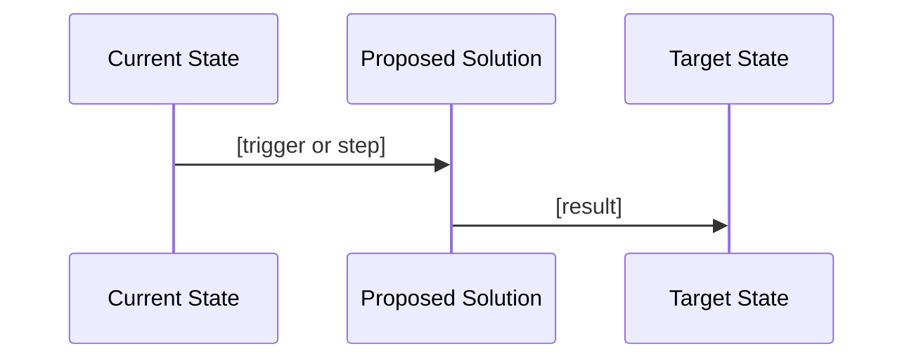
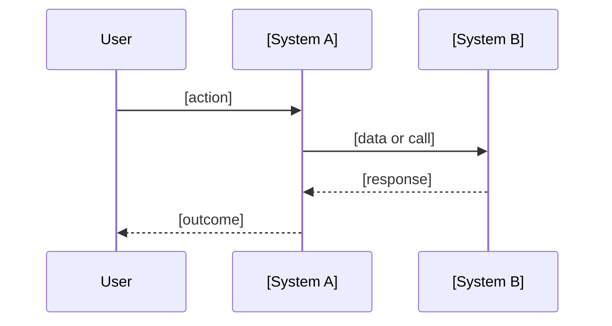

# Idea

Capture a raw idea and stress-test it into a well-framed problem worth solving. Produces a structured `idea.md` and living sequence diagrams that evolve through the project lifecycle.

## Trigger Detection

If the user has NOT run `/user:idea` explicitly but uses informal idea language ("I've been thinking about...", "what if we...", "it would be great if...", "wouldn't it be good to..."), ask once:

> "That sounds like an idea worth capturing — want me to run `/idea` on it?"

If yes, proceed. If no, continue normally.

---

## Process

### 1. Capture the Pitch

Before anything else, assign an IDEA ID:
1. Read `~/.claude/registry.md` — get the next IDEA number
2. Increment the counter and update the registry
3. Note the ID for use throughout the session: e.g. `IDEA-003`

Ask the user to describe the idea in their own words. No structure yet — just let them pitch it. Listen for:
- What problem it solves
- Who has the problem
- What they think the solution might look like

### 2. Grill — One Question at a Time

Work through each area below, one question at a time. Provide a recommended answer or suggested measurement for each. Challenge vague answers.

#### Problem Statement
- What is the specific problem today?
- Who experiences it?
- What is the cost or impact of the problem not being solved?
- Challenge: "Is this actually a problem, or a preference?"

#### Baseline Measurements
- How is the problem currently measured (or how could it be)?
- What are the current numbers?
- Suggest additional metrics the user may not have considered based on the problem domain
- Challenge: "Is this metric actually observable? How would you get this data today?"
- Flag any unvalidated baselines as assumptions

#### Destination Targets
- What does success look like, in measurable terms?
- What specific number or state are we aiming for?
- By when?
- Challenge: "Is this target realistic? What's the evidence?"
- Flag any targets based on assumptions

#### Journey
- How do we get from baseline to destination?
- What are the major steps or interventions?
- What systems or people are involved?
- What dependencies or blockers exist?
- Challenge: "Is this the only way? What could go wrong?"

#### Impact vs Effort
After the four areas above, estimate:
- **Impact:** High / Medium / Low — how significant is the outcome if successful?
- **Effort:** High / Medium / Low — how much work to get there?
- Present as a 2x2 and ask the user to confirm

```
         LOW EFFORT    HIGH EFFORT
HIGH IMPACT  ★ Pursue now   → Plan carefully
LOW IMPACT   → Consider     ✗ Probably skip
```

#### Assumptions to Validate
List every assumption made during the grill:
- Baseline data not yet confirmed
- Targets based on estimates
- Journey steps that depend on unknowns
- Each assumption tagged: Unvalidated / Confirmed / Invalidated

### 3. Draft Journey Diagram (Mid-Grill)

After the Journey section is explored — before the grill is complete — produce a draft Mermaid sequence diagram to represent understanding so far. Present it inline.



Ask: "Does this represent the idea correctly? What's missing or wrong?"

Update based on feedback before continuing.

### 4. Complete the Grill

Return to any remaining questions. Once all four areas plus assumptions are captured, produce the **Idea Summary** for confirmation.

### 5. System Interaction Diagram

After the grill is complete, produce a second Mermaid diagram showing system interactions — what talks to what in the proposed solution.



### 5.5 — Feature-Level Estimate

After the grill is complete and before the decision gate, generate a feature-level estimate:

1. Based on the problem statement, journey, and proposed approach, estimate:
   - **AI Token Cost band** — how much AI execution will this feature require to build?
   - **Story Points** — how complex and uncertain is this relative to other work?

2. Present as a table for human confirmation:

```
## Feature Estimate — [Idea Name]

| Metric | Estimate | Reasoning |
|--------|----------|-----------|
| AI Token Cost | S/M/L/XL | [one sentence] |
| Story Points | 1/2/3/5/8/13 | [one sentence] |

⚠️ XL flag: [none / this feature requires /break-down before /build]

Confirm these estimates or adjust before proceeding to the decision gate.
```

3. On confirmation, add to `idea.md`:

```markdown
## Estimates
**AI Token Cost:** [band] ([range])
**Story Points:** [N]pts
**Last estimated:** YYYY-MM-DD
**Status:** Current
```

4. If XL — note explicitly: "This feature will require `/break-down` before `/build` can execute it."

### 6. Decision Gate

Present the completed idea summary and ask:

```
This idea is ready for a decision.

Impact: [High/Medium/Low]
Effort: [High/Medium/Low]

Type ACCEPT, DECLINE, or HOLD.
```

**ACCEPT** → move to `~/.claude/ideas/active/[idea-name]/`, suggest `/user:create-project`
**DECLINE** → ask for reason, archive to `~/.claude/ideas/archived/[idea-name]/`
**HOLD** → save to `~/.claude/ideas/active/[idea-name]/` with status `Holding`

### 7. Save Files

Save to the appropriate folder:

- `idea.md` — full structured document (with IDEA-NNN in header)
- `diagram.mmd` — current diagram (always latest)
- `diagram-v1-idea.mmd` — baseline snapshot at idea stage

Update `~/.claude/registry.md` Idea Registry table:
```markdown
| IDEA-NNN | [Idea Name] | Active/Holding/Declined | — | ~/.claude/ideas/[active|archived]/[idea-name]/ |
```

---

## idea.md Template

```markdown
# Idea: [Idea Name]

**ID:** IDEA-NNN
**Status:** Active | Holding | Declined
**Created:** YYYY-MM-DD
**Last updated:** YYYY-MM-DD
**Impact:** High | Medium | Low
**Effort:** High | Medium | Low
**Project:** PROJ-NNN | None (updated when /create-project runs)

external_ids:
  jira: (populated by /link-jira — omit until linked)

---

## Problem Statement

[What is the specific problem, who has it, and what is the cost of not solving it]

---

## Baseline Measurements

| Metric | Current Value | Source | Validated? |
|--------|--------------|--------|-----------|
| | | | Unvalidated / Confirmed |

---

## Destination Targets

| Metric | Target Value | By When | Basis |
|--------|-------------|---------|-------|
| | | | |

---

## Journey

[How we get from baseline to destination — major steps, systems involved, dependencies]

---

## Impact vs Effort

```
         LOW EFFORT    HIGH EFFORT
HIGH IMPACT  [position]
LOW IMPACT
```

**Recommendation:** [Pursue now / Plan carefully / Consider / Probably skip]

---

## Assumptions to Validate

| Assumption | Area | Status | Notes |
|------------|------|--------|-------|
| | Baseline / Target / Journey | Unvalidated | |

---

## Decision

**Decision:** Accepted | Declined | Holding
**Date:** YYYY-MM-DD
**Reason:** [Why accepted, declined, or held]

---

## Diagram Version History

| Version | Stage | Date | Notes |
|---------|-------|------|-------|
| v1-idea | Idea capture | YYYY-MM-DD | Baseline diagram |
| v2-design | Post grill-me | | |
| v3-prd | Post write-prd | | |
| v4-final | Post approve | | |
```

---

## Diagram Update Points

At each pipeline stage, update `diagram.mmd` and save a versioned snapshot:

| Stage | Trigger | Snapshot name |
|-------|---------|--------------|
| Idea capture | End of `/idea` | `diagram-v1-idea.mmd` |
| Design | End of `/grill-me` | `diagram-v2-design.mmd` |
| PRD | End of `/write-prd` | `diagram-v3-prd.mmd` |
| Final | `/approve` | `diagram-v4-final.mmd` |

---

## Rules

- Ask one question at a time during the grill
- Challenge unmeasurable baselines and vague targets before accepting them
- Suggest additional metrics — present as options, not requirements
- Draft journey diagram must be produced mid-grill, before grill is complete
- Never save files until the decision gate is reached
- Declined ideas are never deleted — always archived with a reason
- HOLD is a valid outcome — not every idea needs an immediate decision
- Always generate a feature-level estimate before the decision gate — never skip it
- XL estimates must be flagged immediately with a `/break-down` requirement note

## Token Recording (Automatic)

After the decision gate, record token usage in `docs/tokens/[feature-name].md` (create from template if new):

```markdown
### Idea
**Date range:** YYYY-MM-DD
**Sessions:** N
**Input:** ~Nk tokens — Read: [conversation only / any files read]
**Output:** ~Nk tokens — [idea.md, diagrams, estimate]
**Total:** ~Nk ([band])
**Notes:**
```

See `~/.claude/skills/token-report/TOKEN-RECORDING.md` for estimation guidance.
