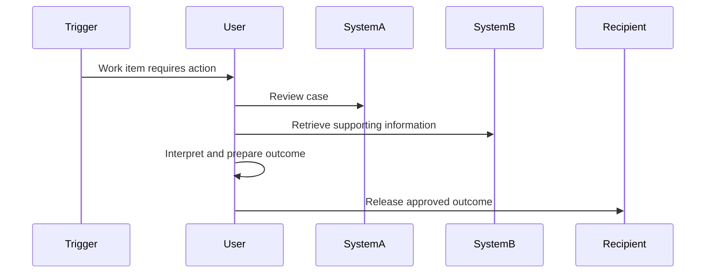
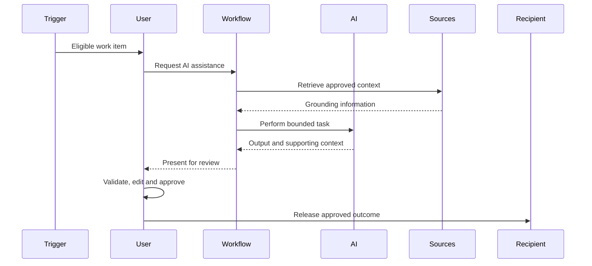
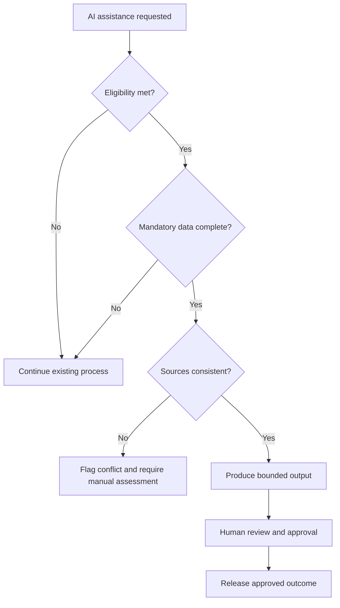

# Output Templates

Structures for `idea-ai-review.md` and its diagrams. Write files only once the review is sufficiently complete for the selected mode, and never claim a file was saved unless the write succeeded.

---

## Rapid Triage

```markdown
# AI Idea Rapid Triage: [Idea Name]

**Review mode:** Rapid Triage
**Maturity:** [Stage]
**Primary disposition:** [Disposition — a recommendation, not a decision]

## Executive View
[One paragraph: problem, AI suitability, strongest condition, principal risk, disposition.]

## Problem Evidence
## Existing Capability Indication
## Why AI?
[Best AI option against the strongest non-AI alternative.]
## Principal Benefit
[Measure and confidence.]

## Critical Feasibility Conditions
1.
2.
3.

## Principal Risks
1.
2.
3.

## Top Five Unknowns
[The five most likely to change the disposition.]
1.
2.
3.
4.
5.

## Immediate Next Gates
1.
2.
3.
```

---

## Full Review

```markdown
# AI Idea Review: [Idea Name]

**Idea ID:** [AI-IDEA-NNN or AI-IDEA-UNREGISTERED]
**Review date:** YYYY-MM-DD
**Review mode:** Full Review
**Review status:** Draft | Final
**Business area:** [Area]
**Proposed platform:** [Platform or Unknown]
**Primary disposition:** [Disposition — a recommendation, not a decision]
**Maturity:** [Stage]
**Impact:** High | Medium | Low
**Effort:** High | Medium | Low | Not estimable
**Risk:** High | Medium | Low | Requires specialist assessment
**Evidence confidence:** High | Medium | Low
**Benefit confidence:** High | Medium | Low | Not established

> This review grants no architecture, security, privacy, legal, Responsible AI,
> funding, delivery or production approval.

## 1. Executive Assessment
[Problem, AI suitability, reuse, data and platform conditions, principal risk, maturity, disposition.]

## 2. Original Submission
[Preserve the supplied wording, or label a summary as a summary.]

## 3. Normalised Definition
### 3.1 Problem Statement
### 3.2 Outcome Statement
### 3.3 Solution Hypothesis
### 3.4 Proposed AI Role

## 4. Existing Capability Review

## 5. Evidence Register

| Evidence ID | Claim | Evidence | Source | Status |
|---|---|---|---|---|
| EVD-01 | | | | |

## 6. Current State and Problem Validation

## 7. Baseline and Volumetrics

| Measure | Current Value | Scope | Period | Source | Confidence |
|---|---:|---|---|---|---|

## 8. Outcomes and Benefit Realisation

| Benefit | Measure | Baseline | Target | Basis | Owner |
|---|---|---:|---:|---|---|

## 9. AI Suitability and Alternatives

| Option | Assessment | Strength | Limitation |
|---|---|---|---|

## 10. Scope and Boundaries
### In Scope
### Out of Scope
### Entry Conditions
### Exit Conditions
### Stop Conditions

## 11. Data Readiness

| Data Source | Information | Owner | Access | Quality | Classification | Status |
|---|---|---|---|---|---|---|

## 12. Source Authority

| Business Fact | Primary Source | Secondary Source | Conflict Rule |
|---|---|---|---|

## 13. Platform and Architecture
## 14. Prompt Governance
## 15. Governance and AI Register

## 16. Operational Ownership

| Area | Accountable Role | Status | Evidence or Gap |
|---|---|---|---|

## 17. Pilot and Confidence Controls
## 18. Output Contract
## 19. Quality Evaluation and Monitoring
[Cite `[EVL-TBD — …]`; $write-ord mints the EVL-NNN.]

## 20. Failure Modes and Controls

| ID | Failure Mode | Outcome | Preventive Control | Detective Control | Fallback | Owner |
|---|---|---|---|---|---|---|
| FM-01 | | | | | | |

## 21. Delivery, Change and Reuse Readiness

## 22. Dependencies

| Dependency | Owner | Status | Blocking? | Evidence |
|---|---|---|---|---|
| DEP-01 | | | | |

## 23. Assessment Ratings and Maturity

| Dimension | Rating | Evidence Confidence | Rationale |
|---|---|---|---|
| Impact | | | |
| Effort | | | |
| Risk | | | |
| AI suitability | | | |
| Data readiness | | | |
| Platform fit | | | |
| Governance readiness | | | |
| Operational readiness | | | |
| Pilot readiness | | | |

## 24. Findings

| ID | Type | Finding | Evidence | Significance | Confidence |
|---|---|---|---|---|---|
| FND-01 | | | | | |

## 25. Assumptions and Validation

| ID | Assumption | Area | Status | Validation Method | Owner | Decision Impact |
|---|---|---|---|---|---|---|
| ASM-01 | | | | | | |

## 26. Acceptance-Criteria Review
### Existing Criteria Assessment
### Proposed Functional Criteria
### Proposed Data and Source Authority Criteria
### Proposed Quality Criteria
### Proposed Safety and Control Criteria
### Proposed Operational and Monitoring Criteria
### Proposed Benefit Validation Criteria
[Each written `[AC-TBD — …]`; $write-ac mints the AC-NNN.]

## 27. Disposition

**Primary recommendation:** [Disposition]

### Rationale
1.
2.
3.

### Mandatory Gates
1.
2.
3.

## 28. Prioritised Discovery Actions

| Priority | Action | Question Resolved | Required Evidence | Suggested Owner |
|---:|---|---|---|---|
| 1 | | | | |

## 29. Decision Record

**Portfolio decision:** Pending | Approved | Hold | Redirect | Decline
**Decision date:**
**Decision-maker:**
**Reason:**
**Conditions:**
```

**Section 29 stays `Pending`** until the authorised decision-maker types `APPROVED`, `HOLD`, `REDIRECT` or `DECLINE`.

---

## Diagrams

Draw a diagram only where enough information exists, and label an unvalidated interaction as proposed.

### Current State — `current-state.mmd`



### Proposed State — `proposed-state.mmd`



### Exception Flow — `exception-flow.mmd`

Draw this where exclusions or source conflicts materially affect the design.


